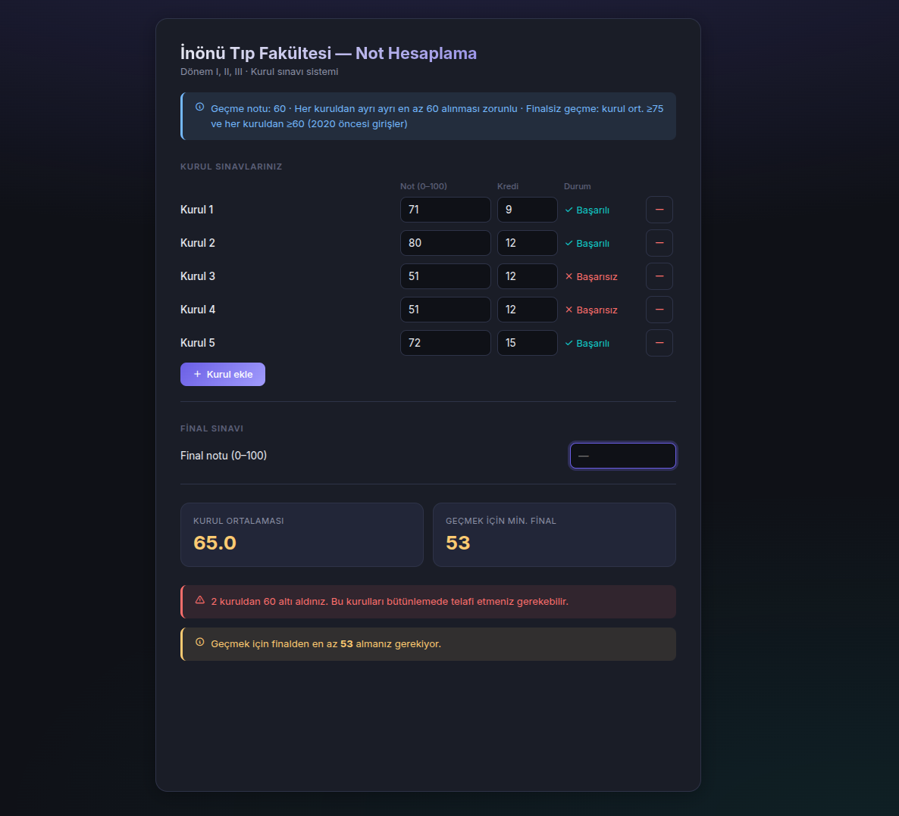
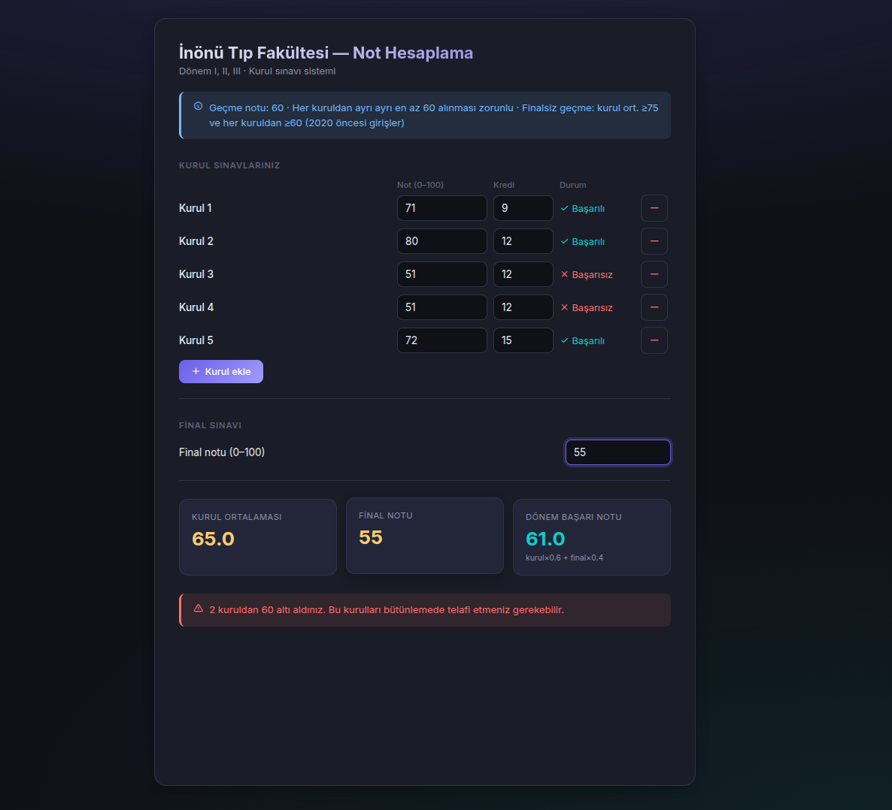
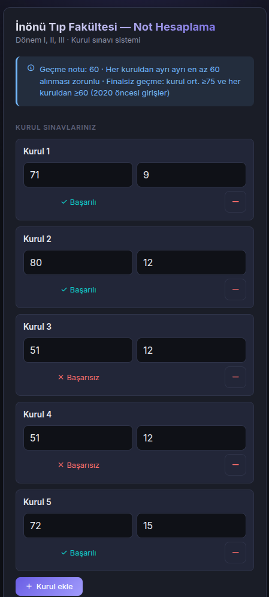
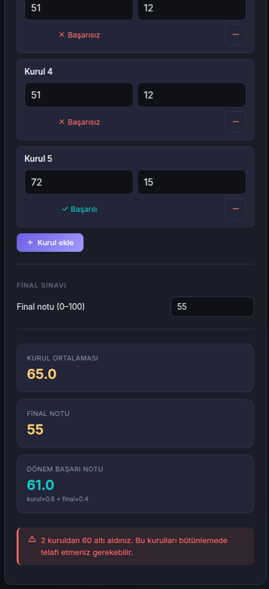

# 🎓 Boncuk — İnönü Tıp Fakültesi Not Hesaplama

İnönü Üniversitesi Tıp Fakültesi öğrencileri için kurul sınavı not hesaplama aracı.

## ✨ Özellikler

- **Kurul not girişi** — Sınırsız kurul ekleme/çıkarma, not ve kredi bilgisi
- **Anlık hesaplama** — Ağırlıklı kurul ortalaması, geçmek için gereken minimum final notu, dönem başarı notu
- **Durum bildirimi** — Başarılı/başarısız durumu renk kodlarıyla anlık gösterim
- **Mobil uyumlu** — Telefon ve tablette sorunsuz çalışan responsive tasarım
- **Modern arayüz** — Koyu tema, gradient efektler, animasyonlu kartlar

## 📐 Hesaplama Formülü

| Parametre | Formül |
|---|---|
| Kurul Ortalaması | `Σ(not × kredi) / Σ(kredi)` |
| Dönem Başarı Notu | `kurul_ort × 0.6 + final × 0.4` |
| Geçme Koşulu | Dönem notu ≥ 60 ve her kuruldan ≥ 60 |

## 📸 Ekran Görüntüleri

### Masaüstü Görünümü

| Not Girişi | Sonuç Ekranı |
|---|---|
|  |  |

### Mobil Görünüm

| Not Girişi | Sonuç Ekranı |
|---|---|
|  |  |

## 🚀 Kullanım

Dosyayı tarayıcınızda açmanız yeterlidir:

```bash
# Doğrudan tarayıcıda aç
xdg-open index.html
```

Herhangi bir kurulum veya sunucu gerekmez — tamamen istemci taraflı çalışır.

## 🛠️ Teknolojiler

- **HTML5** — Semantik yapı
- **CSS3** — CSS Variables, Grid, Flexbox, animasyonlar
- **Vanilla JS** — Bağımlılıksız, saf JavaScript
- **Inter** — Google Fonts tipografi
- **Tabler Icons** — Simge kütüphanesi

## 📄 Lisans

Bu proje açık kaynaklıdır. Eğitim amaçlı kullanılabilir.
